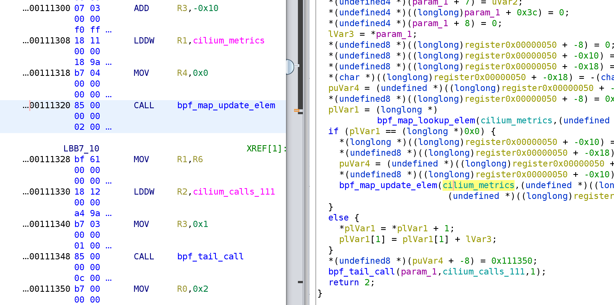
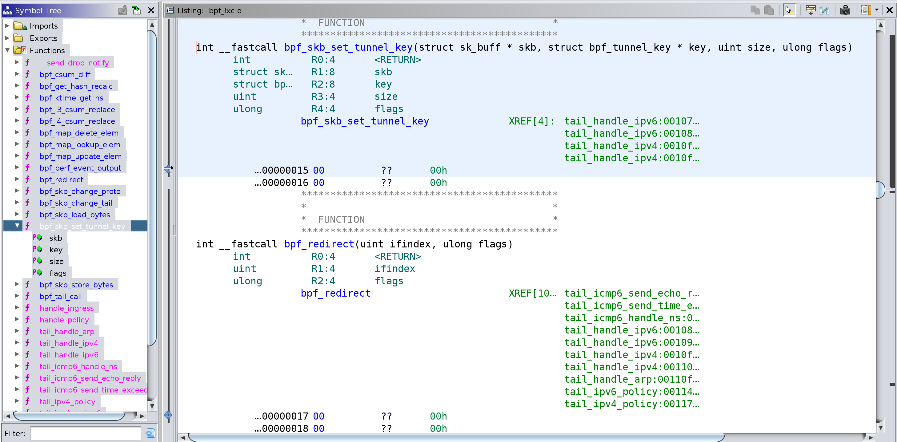
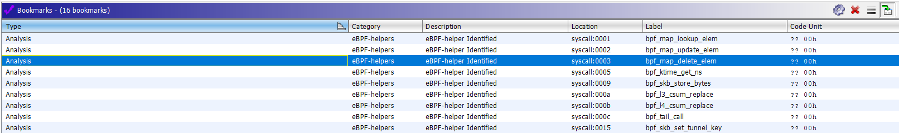
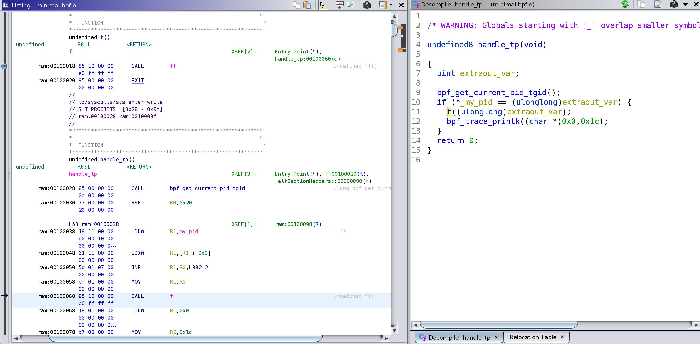

# eBPF processor for Ghidra

The extension implements eBPF architecture support for Ghidra and allows for disassembly and decompilation of ELF files containing eBPF programs.

Example of eBPF program you can get 
[here](https://github.com/vbpf/ebpf-samples).

Example of disassembling and decompiling of eBPF:

# Installation
  
- Download Release version of extension and install it in Ghidra `File → Install Extensions...` 
- Use gradle to build extension: `GHIDRA_INSTALL_DIR=${GHIDRA_HOME} gradle` and use Ghidra to install it: `File → Install Extensions...` 
- Clone this repository to `\Ghidra\Extensions` directory.

# Updates

03.09.2019 — eBPF maps implementation, custom relocation handler was implemented

19.09.2019 — problem with stack [is resolved](https://github.com/Nalen98/eBPF-for-Ghidra/issues/2#issuecomment-533263382)

20.09.2019 — eBPF call-helpers are implemented as syscalls, added helper's signature through custom eBPFAnalyzer

23.09.2019 — bad bookmarks fixed

01.12.2020 — new eBPF-helpers added

23.06.2022 — added support for relative calls (`R_BPF_64_32` relocation type). Thanks [@cnwangjihe](https://github.com/cnwangjihe) for this [idea](https://github.com/Nalen98/eBPF-for-Ghidra/pull/10). `imm` of call instruction where `bpf_call->src_reg == BPF_PSEUDO_CALL` now contains the relative offset to target function.

Before:

After:

24.06.2022 — making the [Pull Request](https://github.com/NationalSecurityAgency/ghidra/pull/4378) to official [Ghidra](https://github.com/NationalSecurityAgency/ghidra) repository as the main supplier of the eBPF processor

19.12.2022 — added support for BPF_ATOMIC operations, ALU32 instructions added, BPF_JMP32 instructions added, JSET instruction fixed

03.05.2023 — eBPF processor support added to the Ghidra official repository in the commit [506ca1e](https://github.com/NationalSecurityAgency/ghidra/commit/79102c13c48b56e8173a0754d2804f4fe25adf22). Expected to work out of the box in the next Ghidra release 10.3. 

## eBPF support out of the box in Ghidra

Despite the inclusion of this project in the Ghidra, I will continue to maintain this repository. If you have problems or questions, you can open an issue either here or in the Ghidra repository. This repository will continue to be maintained in order to be able to work with older versions of Ghidra.

# Useful links

* [Official kernel documentation](https://www.kernel.org/doc/Documentation/networking/filter.txt)

* [Official kernel documentation - questions](https://www.kernel.org/doc/html/latest/bpf/bpf_design_QA.html)

* [eBPF programs to test in Ghidra](https://github.com/vbpf/ebpf-samples)

* [Simple eBPF disassembler in Rust](https://github.com/badboy/ebpf-disasm)

* [Rust virtual machine and JIT compiler for eBPF programs](https://github.com/qmonnet/rbpf) 

* [eBPF helpers (all)](https://github.com/torvalds/linux/blob/v5.17/include/uapi/linux/bpf.h#L2619)

* [eBPF overview](https://www.collabora.com/news-and-blog/blog/2019/04/05/an-ebpf-overview-part-1-introduction/)

