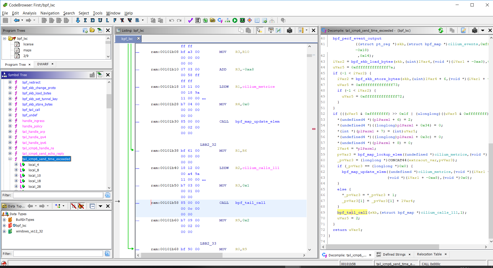

# eBPF-for-Ghidra

This project was initially started as a part of [Digital Security](https://github.com/DSecurity)'s Research Centre internship ["Summer of Hack 2019"](https://dsec.ru/about/traineeship/).

The extension implements eBPF architecture support for Ghidra and allows for disassembly and decompilation of ELF files containing eBPF programs.

Example of eBPF program you can get 
[here](https://github.com/vbpf/ebpf-samples).

# Installation
  
- Download Release version of extension and install it in Ghidra `File → Install Extensions...` 
- Use gradle to build extension: `GHIDRA_INSTALL_DIR=${GHIDRA_HOME} gradle` and use Ghidra to install it: `File → Install Extensions...` 
- Clone this repository to `\Ghidra\Extensions` directory.

# Screenshots

Example of disassembling and decompiling of eBPF

Function Graph for eBPF

# Updates

03.09 - eBPF maps implementation (added string info of map in decompiler and disassembler by using custom relocation handler)

19.09 - stack problem [is resolved](https://github.com/Nalen98/eBPF-for-Ghidra/issues/2#issuecomment-533263382). eBPF call-helpers are implemented as syscalls (added helper's signature through custom eBPFAnalyzer)

# Useful links

* [Official kernel documentation](https://www.kernel.org/doc/Documentation/networking/filter.txt)

* [Official kernel documentation - questions](https://www.kernel.org/doc/html/latest/bpf/bpf_design_QA.html)

* [eBPF programs to test in Ghidra](https://github.com/vbpf/ebpf-samples)

* [Simple eBPF disassembler in Rust](https://github.com/badboy/ebpf-disasm)

* [Rust virtual machine and JIT compiler for eBPF programs](https://github.com/qmonnet/rbpf) 

* [eBPF helpers (all)](https://github.com/torvalds/linux/blob/v4.20/include/uapi/linux/bpf.h#L437)

* [eBPF overview](https://www.collabora.com/news-and-blog/blog/2019/04/05/an-ebpf-overview-part-1-introduction/)

